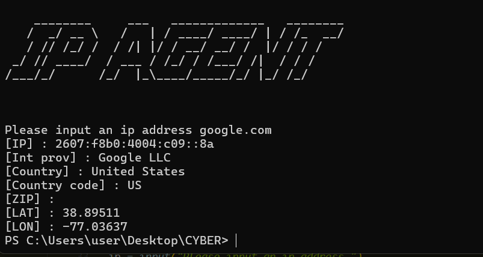

# IP_Agent

**IP AGENT** is a simple Python tool that allows you to fetch geolocation and ISP information of any given IP address using the [ip-api.com](http://ip-api.com) service. The tool displays the IP information in a clean and easy-to-read format.

---

## Features

- Fetch IP address details including:
  - IP address
  - Internet service provider (ISP)
  - Country and country code
  - ZIP code
  - Latitude and Longitude
- Command-line interface with an ASCII banner
- Simple and lightweight

---

## Requirements

- Python 3.6+
- [Requests](https://pypi.org/project/requests/)
- [PyFiglet](https://pypi.org/project/pyfiglet/)

Install dependencies using pip:

```bash
pip install requests pyfiglet
Usage
Clone or download the repository.

Run the script using Python:

bash
Copy code
python ip_agent.py
Enter the IP address when prompted:

css
Copy code
Please input an ip address: 8.8.8.8
The tool will display information like:

csharp
Copy code
[IP] : 8.8.8.8
[Int prov] : Google LLC
[Country] : United States
[Country code] : US
[ZIP] : 90210
[LAT] : 37.751
[LON] : -97.822
Example
Copy code

Make sure you have an active internet connection.

The tool uses a free public API which may have request limits.

Only valid IPv4 addresses are supported.

